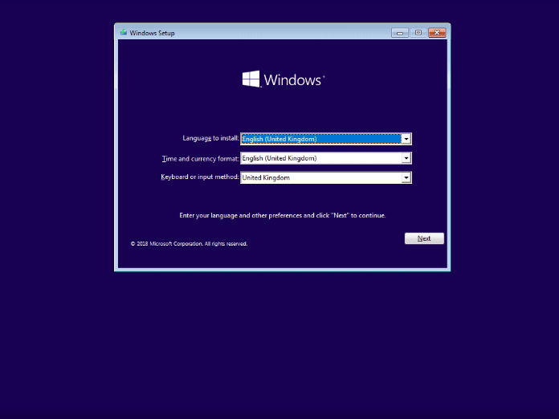
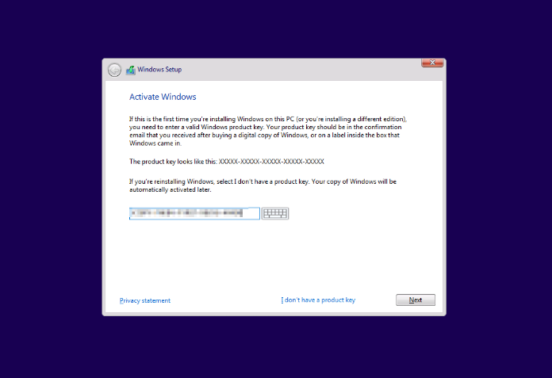
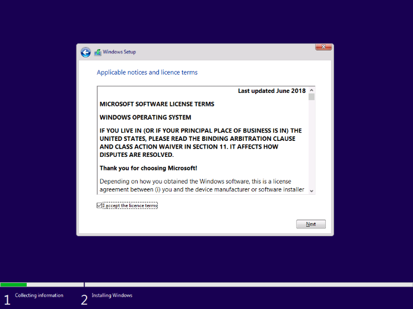

# Installing Windows 10

This article covers the steps of re-installing, or fresh installing Windows 10 from a USB.

## Prerequisites
* For Method 1, the drive that you are installing Windows to requires enough space to move the contents of the drive to a folder called windows.old.
* The disk that you are trying to Install Windows on must be a GPT partition style disk if you are on a UEFI system, otherwise it will not let you install. 
  * This can be worked around by booting in Legacy mode, or by formatting the disk and then converting it to GPT using Diskpart.

## Installing

1. Select the correct Language, Time and Currency, and Keyboard layout then press Next.

    

2. Click Install Now.

    

3. Enter your product key if you know it, otherwise click I don't have a product key.

    

4. Accept the agreement.

    

5. On the next screen, click Custom.

    

## Method 1

> Re-installing and keeping your data.

1. On the next screen, you will see a list of partitions for each disk you have, you want to select the partition marked "Primary" on the disk that you have Windows installed on, and that has a similar amount of space as the drive you have Windows installed on (If Windows is installed on Disk 0, and it's maximum amount of space is 30GB, then you would select the partition on Drive 0 with 30GB of total space marked as "Primary").

After this, click Next.

Windows will now start re-installing on the partiton that you selected. It will move any data from that partition to a folder located at C:\windows.old if there is enough space.

## Method 2

> Clean re-installing, not keeping any data

1. On the next screen, you will see a list of partitions for each disk you have, you want to select the partition marked "Primary" on the disk that you have Windows installed on, and that has a similar amount of space as the drive you have Windows installed on. (If Windows is installed on Disk 0, and it's maximum amount of space is 30GB, then you would select the partition on Drive 0 with 30GB of total space marked as "Primary"). After this, click the "Format" button at the bottom. **THIS WILL ERASE ALL DATA ON THE SELECTED PARTITION** and then click Next.

