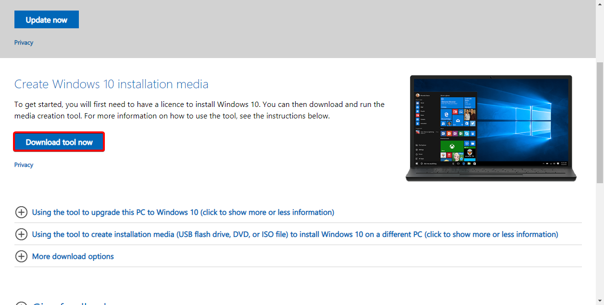
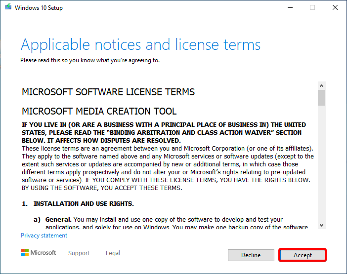
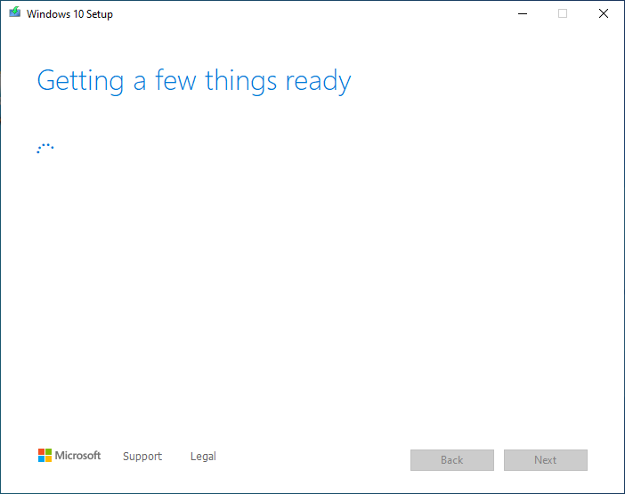
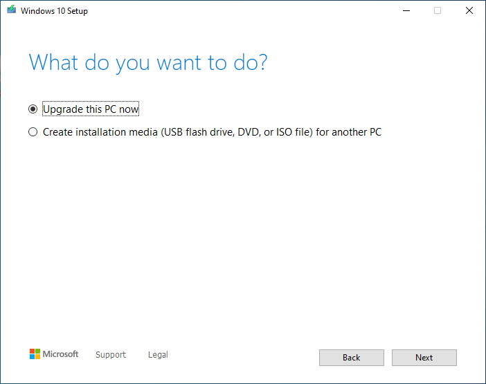
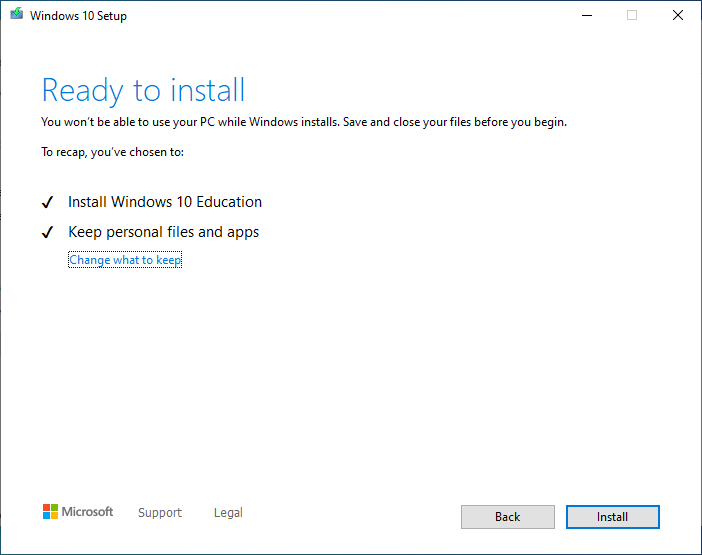
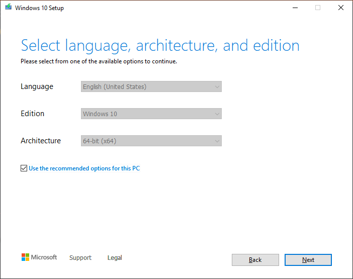
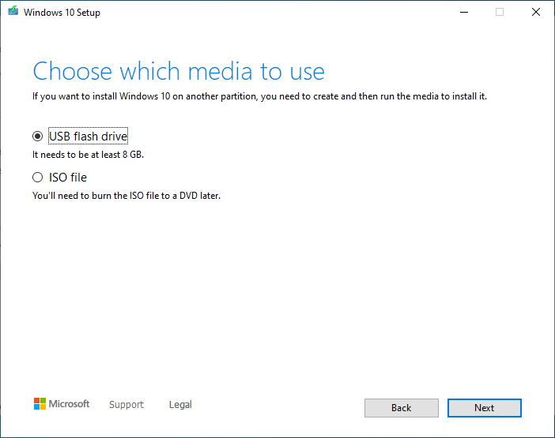
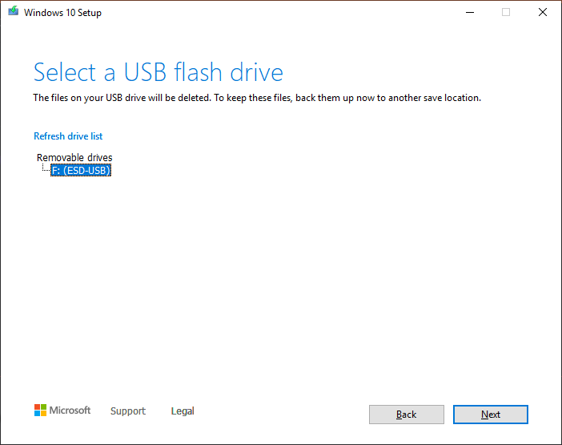

# Using The Media Creation Tool

One of the most common solutions to many problems in Windows is reinstalling it. While built-in settings exist that do this, they rely on an embedded image that  can often become unstable or unusable, and as such the Media Creation Tool is recommended for this purpose.

## Prerequisites
 * 8+GB of space on the C: drive is required to run the tool.
 * For Method 2, a **blank** USB with **8+GB** of space is required.

### Downloading The Tool
1. Go to [https://www.microsoft.com/en-gb/software-download/windows10](https://www.microsoft.com/en-gb/software-download/windows10)
2. Click the **Download Tool Now** button. 
    
3. After the tool has been downloaded, run it.

### Using The Tool

1. The first thing you will see is this screen, click Accept.

    

2. The next screen you see will be this, wait for the installer to send you to the next.

    

3. This is where you select what you want to do, if you want to **repair the Windows installation on this computer** click **Upgrade this PC now** and follow Method 1. If you **want to reinstall Windows on another computer** click **Create installation media** and follow Method 2.

    

## Method 1

1. This is the screen that you will see, wait for Windows 10 to finish downloading.

    

2. This is the final screen you will see before it starts re-installing Windows 10. Assuming that you want to keep your files, you can just press *Install*,
    > Alternatively, you can click *change what to keep* and choose either Personal Files and Apps, Personal Files, or Nothing,

    After this, the tool will start re-installing Windows 10.

    

## Method 2

You need a **blank** USB with **8+GB of space** for the following steps. 

1. Select the correct Architecture, Edition and Language of Windows 10, or use the recommended settings.
    > If you're planning on installing Windows on another PC and don't know what to select for the architecture, then choose both x86 and x64.

    

2. Select USB Flash Drive.

    

3. Select your USB that you have inserted. **ANY DATA ON THE USB WILL BE ERASED**

    

4. Wait for Windows 10 to finish downloading.

    

After this, you will see a screen saying that the Flash Drive is ready. Click finish, take out the USB, and insert it into the computer that is not working.

#### How to re-install Windows using a USB

1. Turn on the computer that is not working, and repeatedly press either <kbd>F12</kbd>, <kbd>F11</kbd>, <kbd>F10</kbd>, or <kbd>F9</kbd> depending on your manufacturer to enter the Boot Menu. To find out the key you need to press, search on Google "[PC manufacturer] boot menu key".

2. Once open, move the cursor using the arrow keys to the name of the USB you have inserted and then press Enter.

You will now boot to the Windows 10 Installer. For further guidance, see [Installing Windows 10](installing-windows-10)
